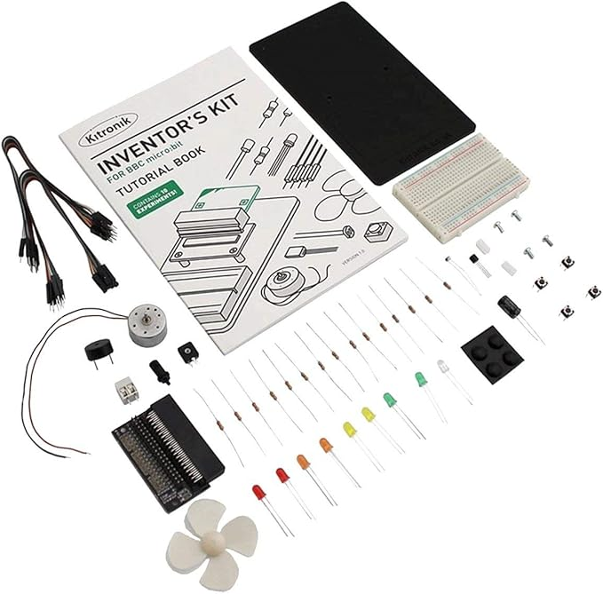

+++ { "kind": "split-image" }

## Micro:bit Robotproject – Schakelingen, sensoren en aansturing

een handige ondersteuning bij het micro:bit robotproject


Hans Klok  
Het Lyceum Rotterdam 



+++

Dit online tekstboek ondersteunt je tijdens het micro:bit-robotproject bij het bouwen en testen van schakelingen met sensoren en actuatoren. Je vindt hier korte uitleg, voorbeeldschakelingen en Python-voorbeelden die je helpen wanneer je tijdens het project ergens vastloopt. Gebruik dit boek als eerste hulpmiddel bij technische vragen, zodat je zelfstandig verder kunt werken aan je robot.

+++ {"kind": "justified"}
## Quick navigation
````{grid} 2
```{card}
:header: Introductie en coderegels
:link: Quickstart.md

Een korte introductie over afspraken rondom programmeren
```
```{card}
:header: Basis elektronica
:link: elektronica.md

Alles over plus, min, stroom, weerstanden en transistoren
```
```{card}
:header: micro:bit pins
:link: pins.md

Overzicht van de pins van de micro:bit: digitaal, analoog, input en output
```
```{card}
:header: Actuatoren
:link: actuatoren.md

Het aansturen van motoren, ledjes, grijparmen
```
```{card}
:header: Sensoren
:link: sensoren.md

Het uitlezen van sensoren zoals een lichtsensor of een afstandssensor
```
```{card}
:header: Communicatie
:link: radio.md

Het aansturen van een tweede micro:bit met radiosignalen
```
````
