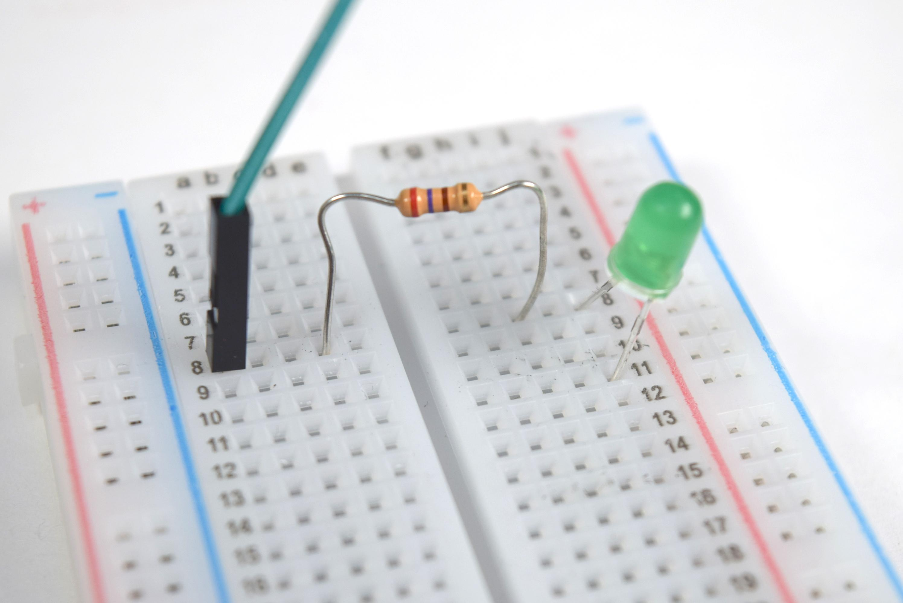
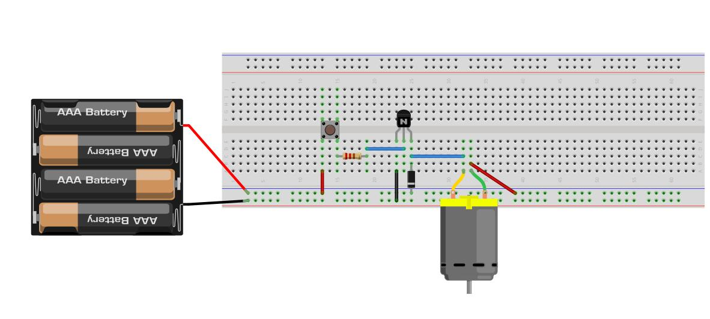

# Elektronica

Om een robot te bouwen met de micro:bit werk je met elektronische schakelingen. Daarin lopen elektrische stromen door draden en componenten. In dit hoofdstuk leer je hoe stroom werkt en welke rol **plus**, **min**, **weerstanden** en **transistoren** spelen.

## Stroom: van plus naar min
Elektrische stroom kun je vergelijken met water dat door een slang stroomt. De batterij of voeding zorgt ervoor dat stroom kan bewegen.

In een schakeling geldt:

 - stroom loopt **van plus naar min** 
 - er moet altijd een **gesloten
   kring** zijn
 - zonder gesloten kring werkt een component niet

Bijvoorbeeld:

een led gaat alleen branden als:

plus → led → min

correct is aangesloten.

Als ergens de kring onderbroken is, gebeurt er niets.

De micro:bit heeft ook plus- en min-aansluitingen. Die herken je als:

-   **3V** (plus)
-   **GND** (min)

## Weerstanden: bescherming en controle van stroom
Een weerstand zorgt ervoor dat er **niet te veel stroom** door een component loopt.

Zonder weerstand kan bijvoorbeeld:

-   een led kapot gaan
-   een sensor verkeerd werken
-   een schakeling onbetrouwbaar worden

Een weerstand werkt dus als een soort **kraan in een waterleiding**: hij beperkt de hoeveelheid stroom.

Daarom zie je vaak:

micro:bit → weerstand → led → GND

De weerstand beschermt hier de led.

Vuistregel in dit project:

gebruik altijd een weerstand bij een led.

## Transistoren: schakelen met een klein signaal
Soms kan de micro:bit een onderdeel niet direct aansturen. Bijvoorbeeld:

-   motor
-   grijparm
-   grotere actuator

Dat komt omdat deze onderdelen **meer stroom nodig hebben** dan de micro:bit veilig kan leveren.

Daarom gebruiken we een transistor.

Een transistor werkt als een **elektronische schakelaar**:

een klein signaal van de micro:bit  
stuurt een grotere stroom aan uit een externe batterij.

Dus:

micro:bit → transistor → motor

De micro:bit bestuurt dan de transistor, en de transistor bestuurt de motor.

Zo bescherm je de micro:bit én kun je toch sterke onderdelen gebruiken.

### De drie aansluitingen van een transistor

Een transistor heeft drie pootjes:

| naam | functie |
|------|---------|
| Base (B) | stuursignaal van de micro:bit |
| Collector (C) | verbonden met motor |
| Emitter (E) | verbonden met GND |

De **base** bepaalt of de transistor aan of uit staat.

### Hoe herken je de juiste kant van de transistor?

Bij de transistor die we in dit project gebruiken (bijvoorbeeld BC547):

- de platte kant zit aan de voorkant
- de pootjes wijzen naar beneden

Van links naar rechts zijn de pootjes:

Collector – Base – Emitter

Dus:

| positie | aansluiting |
|--------|-------------|
| links | Collector |
| midden | Base |
| rechts | Emitter |

Let op: dit geldt alleen als de **platte kant naar je toe wijst**.

### Hoe sluit je een transistor aan?

Sluit de transistor zo aan:

micro:bit pin → weerstand → Base
Emitter → GND
Collector → motor
motor → batterij +
batterij − → GND

De weerstand tussen pin en base beschermt de micro:bit.

### Waarom zit er een weerstand bij de base?

De base mag niet rechtstreeks op de micro:bit worden aangesloten.

De weerstand:

- beschermt de micro:bit
- zorgt dat de transistor goed schakelt

Gebruik meestal een weerstand van ongeveer:

220Ω – 1kΩ

### Wat gebeurt er als de transistor verkeerd om zit?

Dan gebeurt meestal:

- de motor draait niet
- of de schakeling werkt onbetrouwbaar

De transistor gaat meestal niet direct kapot, maar de schakeling werkt niet zoals bedoeld.

Controleer daarom altijd:

1. staat de platte kant in de juiste richting?
2. zitten de pootjes goed aangesloten?
3. zit er een weerstand tussen pin en base?
4. is GND goed verbonden?

## Samenvatting
In dit project gebruik je drie belangrijke ideeën:

-   stroom loopt alleen in een **gesloten kring**
-   een **weerstand beschermt** componenten tegen te veel stroom
-   een **transistor schakelt** grotere onderdelen veilig aan met behulp van de micro:bit
