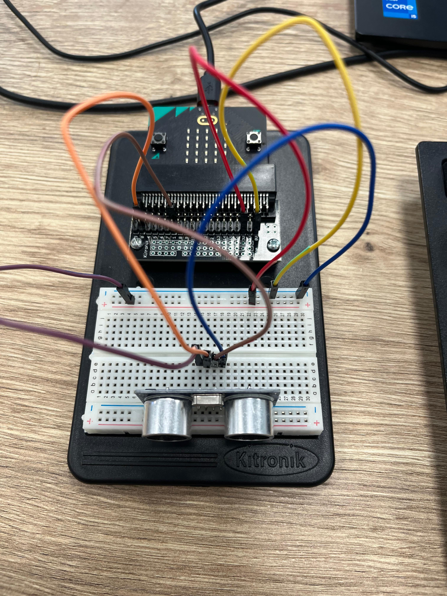

# Sensoren uitlezen met de micro:bit
Sensoren zijn onderdelen die informatie meten uit de omgeving.  In dit robotproject gebruiken we sensoren om te bepalen wat de robot moet doen.
Voorbeelden:
- lichtsensor → meet hoe licht of donker het is
- afstandssensor → meet hoe ver een object weg is

Sensoren sturen informatie **naar** de micro:bit. Dit noemen we **input**.

## Digitale en analoge sensoren

Er zijn twee soorten signalen die sensoren kunnen geven.

### Digitale sensoren
Digitale sensoren hebben maar twee waarden:
- 0 = geen signaal
- 1 = wel signaal

Bijvoorbeeld:een knop ingedrukt of niet.

### Analoge sensoren
Analoge sensoren kunnen veel verschillende waarden geven. Bij de micro:bit liggen deze waarden tussen: 0 – 1023
Bijvoorbeeld:
- hoe licht het is
- hoe ver iets weg is
De meeste sensoren in dit project gebruiken **analoge signalen**.

## Lichtsensor uitlezen
Een lichtsensor meet hoeveel licht er op de sensor valt.
Meer licht → hogere waarde  
Minder licht → lagere waarde

Voorbeeldprogramma:
```python
from microbit import *

# instellingen

LICHT_SENSOR_PIN = pin1

# programma
while True:    
	lichtwaarde = LICHT_SENSOR_PIN.read_analog()    
	display.scroll(lichtwaarde)
```

De micro:bit meet hier steeds hoeveel licht er binnenkomt en toont dit op het display.

### Reageren op licht (beslissing maken)

Je kunt de robot laten reageren op licht.

Bijvoorbeeld:

bij weinig licht gaat een led aan.

```python
from microbit import *

# instellingen

LICHT_SENSOR_PIN = pin1
LED_PIN = pin0

DONKER_DREMPEL = 400
LED_AAN = 1
LED_UIT = 0

# programma

while True:    
	lichtwaarde = LICHT_SENSOR_PIN.read_analog()    
	if lichtwaarde < DONKER_DREMPEL:        
		LED_PIN.write_digital(LED_AAN)    
	else:        
		LED_PIN.write_digital(LED_UIT)
```

Hier bepaalt de variabele `DONKER_DREMPEL` wanneer het donker genoeg is.


## Afstandssensor uitlezen

Een afstandssensor meet hoe ver een object van de robot staat.

Bijvoorbeeld:

-   dichtbij obstakel
-   ver weg van obstakel

Veel afstandssensoren geven een **analoge waarde** terug.

Voorbeeldprogramma:

```python
from microbit import *

# instellingen

AFSTAND_SENSOR_PIN = pin2

# programma
while True:    
	afstandwaarde = AFSTAND_SENSOR_PIN.read_analog() 
	display.scroll(afstandwaarde)
```

Hoe dichter een object bij de sensor komt, hoe meer de waarde verandert.

Let op:

de exacte betekenis van de waarde hangt af van het type sensor.


### Reageren op afstand

De robot kan stoppen wanneer een object te dichtbij komt.

```python
from microbit import *

# instellingen
AFSTAND_SENSOR_PIN = pin2
MOTOR_PIN = pin0
OBSTAKEL_DREMPEL = 500
MOTOR_AAN = 1
MOTOR_UIT = 0

# programma
while True:    
	afstandwaarde = AFSTAND_SENSOR_PIN.read_analog()    
	if afstandwaarde > OBSTAKEL_DREMPEL:        
		MOTOR_PIN.write_digital(MOTOR_UIT)    
	else:        
		MOTOR_PIN.write_digital(MOTOR_AAN)
```

Hier stopt de motor wanneer een obstakel dichtbij komt.

### Sensorwaarden bekijken tijdens testen

Tijdens het bouwen is het handig om eerst alleen de sensorwaarde te bekijken.

Zo kun je bepalen welke drempelwaarde goed werkt:

```python
from microbit import *

# instellingen

SENSOR_PIN = pin1

# programma
while True:    
	sensorwaarde = SENSOR_PIN.read_analog()    
	display.scroll(sensorwaarde)
```

Test dit eerst voordat je beslissingen toevoegt aan je programma.

## Ultrasone afstandssensor gebruiken
De ultrasone afstandssensor (met 4 pinnetjes) verzendt een ultrasoon geluid en meet de tijd totdat deze terugkomt. Door deze tijd om te rekenen kom je tot een aantal centimeters.

De 2 buitenste pinnen van de sensor zijn voor de GND en VCC, de binnenste voor de trigger (om het geluid te versturen) en de echo (om het geluid op te vangen).


```python
from microbit import *
import machine
import utime

# Constants. Stel hier in welke pinnen je gebruikt.
SONAR_SIGNAL_PIN = pin0
SONOR_ECHO_PIN   = pin1

# Variablen
    
def get_afstand():
    # Berekent afstand in cm
    SONAR_SIGNAL_PIN.write_digital(0)   # Zet speaker sonar uit
    utime.sleep_us(2)                   # Wacht 2 microseconden
    SONAR_SIGNAL_PIN.write_digital(1)   # Zet speaker sonar aan (verzend geluid)
    utime.sleep_us(10)                  # Laat het geluid aan voor 10 microseconden
    SONAR_SIGNAL_PIN.write_digital(0)   # Zet speaker sonar uit
    afstandtijd = machine.time_pulse_us(SONOR_ECHO_PIN,1,11600) # Meet tijd tot geluid wordt gemeten
    afstand_cm = afstandtijd / 58       # Deel door 2 (heen en terug) en door snelheid geluid
    return afstand_cm
    
# Hoofdprogramma
SONOR_ECHO_PIN.set_pull(SONOR_ECHO_PIN.NO_PULL)

while True:
    if button_a.was_pressed():        # als op knop A wordt gedrukt, gaan we de afstand meten
        afstand = int(get_afstand())  
        display.scroll(afstand)

```



## PIR-sensor met externe voeding gebruiken

Sommige PIR-sensoren (zoals de HC-SR505) werken **niet altijd betrouwbaar op 3V**.  
In dat geval kun je een **externe batterij** gebruiken.

### Aansluiten met externe voeding

Sluit de PIR-sensor zo aan:

VCC → externe batterij (+) (bijv. 3x AA ≈ 4.5V)
GND → GND batterij én GND micro:bit
OUT → P1


Belangrijk:

- De **GND van de batterij en de micro:bit moeten verbonden zijn**  
- Anders kan de micro:bit het signaal niet goed lezen


### Waarom moet GND gedeeld zijn?

De micro:bit meet spanning ten opzichte van GND.

Als de GND’s niet verbonden zijn:

- krijgt de micro:bit geen stabiel signaal  
- werkt de sensor niet goed  


### PIR uitlezen (zelfde code)

De code verandert niet als je externe voeding gebruikt:

```python
from microbit import *

# instellingen
PIR_SENSOR_PIN = pin1

BEWEGING = 1
GEEN_BEWEGING = 0


# programma
while True:
    sensorwaarde = PIR_SENSOR_PIN.read_digital()

    if sensorwaarde == BEWEGING:
        display.show(Image.YES)
    else:
        display.clear()
```

Let op bij hogere spanning

De uitgang (OUT) van de PIR is meestal: ongeveer 3.3V (veilig voor micro:bit)

Daarom kun je deze meestal direct aansluiten op een pin.

Gebruik geen 5V direct op een micro:bit pin.

Wanneer gebruik je externe voeding?

Gebruik een externe batterij als:

- de sensor altijd 1 geeft
- de sensor niet reageert
- de sensor instabiel werkt

## Kleurensensor VEML6040 gebruiken met de micro:bit

De VEML6040 RGBW Color Sensor Module is een kleurensensor die licht kan meten.
De sensor kan vier verschillende waarden uitlezen:

R = rood
G = groen
B = blauw
W = wit / totale lichtsterkte

De sensor werkt via een communicatieprotocol dat we ook bij andere sensoren tegenkomen: I2C.

Met deze sensor kun je bijvoorbeeld:

- kleuren herkennen
- een lijnvolgende robot maken
- lichtintensiteit meten
- een sorteersysteem bouwen
- onderzoeken hoe RGB-kleuren werken

### Aansluiten van de sensor

De sensor heeft vier aansluitingen:

VIN/VCC --> 3V (dus geen 6V!)
GND --> GND
SDA --> P20 (aan de zijkant van het breadboard)
SCL --> P19 (aan de zijkant van het breadboard)

SDA en SCL zijn de twee datalijnen van I2C. We gebruiken hiervoor dus 2 speciale pinnen, P19 en P20. Let er op dat de gaatjes van deze pinnen, en de gaatjes van de sensor, wat groter zijn dan je gewend bent, de stekkertjes blijven hierdoor minder goed vast zitten.

### Hoe werkt I2C?

Bij I2C praten apparaten met elkaar via twee draadjes:

SDA → data
SCL → kloksignaal

De micro:bit is hierbij de “baas” (master).
De sensor luistert als “slave”.

Iedere I2C-sensor heeft een eigen adres.
De VEML6040 gebruikt standaard adres: 0x10 (hexadecimaal)

### Controleren of de sensor werkt

Voordat we waarden uitlezen, controleren we eerst of de micro:bit de sensor ziet.

```python
from microbit import *

while True:
    print(i2c.scan())
    sleep(1000)
```

Zie je: [16], dan is de verbinding goed. Dit is namelijk gelijk aan 0x10. Hexadecimale getallen worden vaak gebruikt bij I2C-apparaten.

### Sensor inschakelen

De VEML6040 staat standaard soms in een soort slaapstand.
Daarom moeten we hem eerst aanzetten.

```python
i2c.write(0x10, bytes([0x00, 0x00, 0x00]))
```

### RGBW-waarden uitlezen

De sensor bewaart de meetwaarden in zogenaamde registers. We lezen telkens 2 bytes uit een register.

| Register | Betekenis |
|---|---|
| 0x08 | Red |
| 0x09 | Green |
| 0x0A | Blue |
| 0x0B | White |


```python
from microbit import *

ADDRESS = 0x10

def read16(register):

    i2c.write(ADDRESS, bytes([register]))
    data = i2c.read(ADDRESS, 2)

    value = data[0] | (data[1] << 8)

    return value

# VEML6040 inschakelen
# Register 0x00 = config
# 0x00, 0x00 betekent: sensor aan, normale meting
i2c.write(ADDRESS, bytes([0x00, 0x00, 0x00]))

sleep(100)

devices = i2c.scan()
display.scroll(str(devices))

while True:
    red   = read16(0x08)
    green = read16(0x09)
    blue  = read16(0x0A)
    white = read16(0x0B)

    print("R:", red,
          "G:", green,
          "B:", blue,
          "W:", white)

    sleep(500)
```
### Wat betekenen de waarden?

De R, G en B geven de rode, groene en blauwe waarde aan van het licht. Je kunt kleuren herkennen door waarden met elkaar te vergelijken. Hoe hoger een bepaalde waarde, hoe meer de kleur die richting in gaat.

### Omgevingslicht

De sensor meet licht.
Dus:

- zonlicht beïnvloedt de meting
- afstand maakt uit
- schaduw beïnvloedt de waarden

Daarom krijg je niet altijd exact dezelfde waarden.

### De sensor zelf

De echte sensor is het kleine zwarte chipje midden op het printplaatje.
Richt dat chipje naar het object dat je wilt meten.
Geen waarden? Of zie je alleen nullen?

Controleer:

- juiste pinnen?
- P19 en P20 niet omgedraaid?
- GND aangesloten?
- sensor aangezet?
- voldoende licht?

